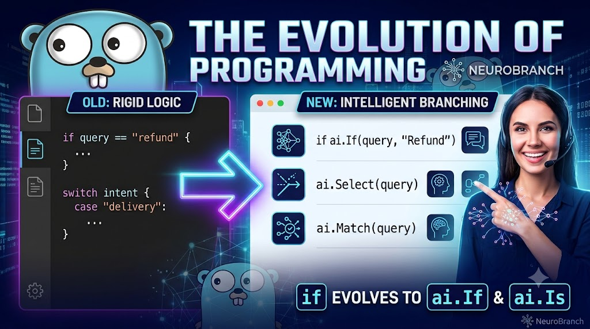

# NeuroBranch Demo Manual & Guide

<p align="center">
  
</p>

## 1. 개요 (Overview)

본 문서는 **NeuroBranch Intelligent Branching Demo**의 실행 및 아키텍처 매뉴얼이다.
순수 Go 언어로 빌드된 초경량 내장 신경망 라우터 엔진을 활용하여, 정적 `if/else` 및 정규식의 취약성과 클라우드 LLM의 네트워크 지연 및 비용 문제를 해결하는 지능형 분기(Intelligent Branching) 실습 코드를 다룬다.

---

## 2. 프로젝트 디렉토리 구조

```text
neurobranch-demo/
├── assets/
│   └── neurobranch.jpg        # 타이틀바 배너 이미지
├── data/
│   └── train.csv              # 도메인 학습 데이터셋 (Query, Intent)
├── weights/
│   └── model.bin              # 컴파일된 가중치 바이너리 (v3 포맷)
├── go.mod                     # Go 모듈 정의
├── main.go                    # 데모 실행 엔트리포인트 (5대 패턴 시연)
├── main_test.go               # 전수 기능 검증 단위 테스트
├── README.md                  # 프로젝트 소개 문서
└── MANUAL.md                  # 데모 상세 가이드 및 매뉴얼
```

---

## 3. 핵심 5대 지능형 분기 패턴

| 패턴 | 함수/형식 | 특성 및 목적 |
| :--- | :--- | :--- |
| **Native Switch** | `switch branch := ai.Select(query); branch` | 자연어 변형을 switch 레이블로 직접 매핑 |
| **Guard Clause** | `if ai.Match(query, "Refund") { ... }` | 단일 의도 타겟팅 및 조기 탈출 분기 |
| **Comma-ok Pattern** | `if branch, ok := ai.Route(query); ok { ... }` | 신뢰도 임계 미달 및 OOD 쿼리의 안전한 격리 |
| **Declarative DSL** | `ai.Branch(query).On("Cancel", ...).Else(...)` | 선언적 함수 체이닝 분기 제어 |
| **Atomic Hot-Swap** | `ai.SwapModel(newModel)` | 무중단 무잠금(Lock-Free) 0 ns 런타임 갱신 |

---

## 4. 실행 및 테스트 방법

### 4.1 전체 단위 테스트 실행

```bash
go test -v ./...
```

### 4.2 데모 애플리케이션 실행

```bash
go run main.go
```
